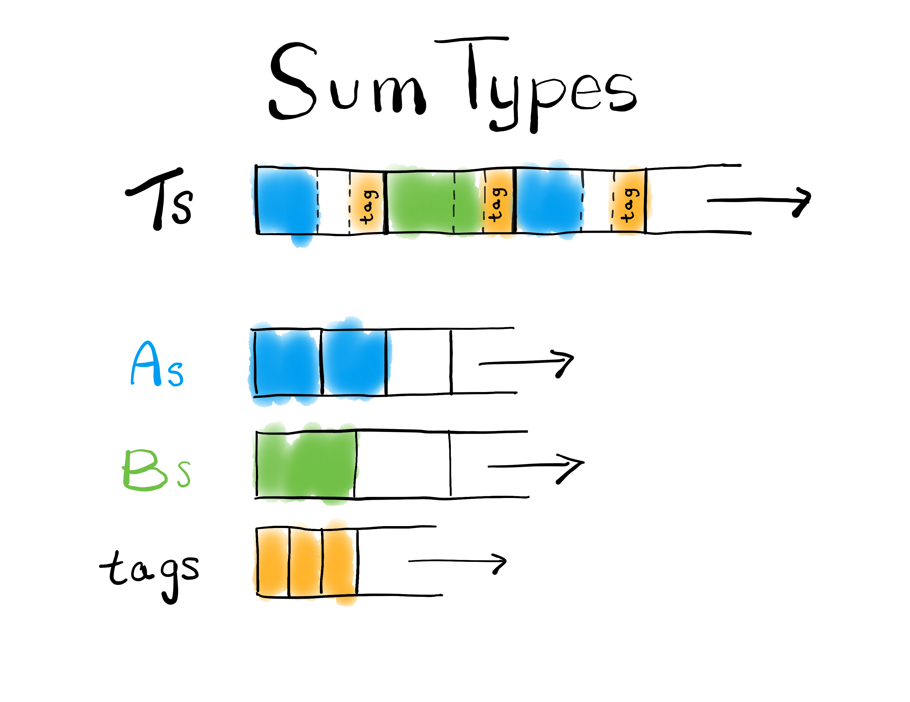

# [Columnar](https://github.com/frankmcsherry/columnar)

High-throughput columnar serialization+ in Rust

[`https://github.com/frankmcsherry/columnar`](https://github.com/frankmcsherry/columnar)


Frank McSherry
Chief Scientist @ Materialize

---

## Intro: I am Frank

I have done many Rust things.
This was the first thing I published in Rust (10+ years ago).

Other things include `timely`, `differential-dataflow`, `datafrog`, ...

---

## Containers for sequences of complex data types

Imagine some non-trivial types you have many of, and would like to efficiently maintain.
```rust
struct Person {
    name: String,
    age: u8,
}

enum Group<T> {
    Solo(T),
    Team(Vec<T>),
    Void,
}
```
You could use `Vec<Group<Person>>`. You *should* start with `Vec<Group<Person>>`! 

There are some reasons you might want different containers, especially for reading.

---

<style>
img[alt~="center"] {
  display: block;
  margin: 0 auto;
}
</style>


---

## A Transformation via Structural Recursion

We are going to transform `Vec<T>` into a few `Vec<_>`s over "simpler" types than `T`.

1.  **Primitive types**. `u8, .., u128`, `i8, .., i128`, `f32, f64`, `()`.

2.  **Product types**. User structs, tuples, enum variants with data, ...

3.  **Sum types**. User enums, `Option`, `Result`, ...

4.  **List types**. `Vec` itself, `String`, boxed slices, maps, ...

Primitive types stay as they are, but other types will need attention!
We'll can (and will) get more specific, but let's start with pictures.

---


---



---


---

## A Transformation via Structural Recursion

We are going to transform `Vec<T>` into a few `Vec<_>`s over "simpler" types than `T`.

1.  **Primitive types**. `u8, .., u128`, `i8, .., i128`, `f32, f64`, `()`.

    This is our base case; these will stay as `Vec`. 

2.  **Product types**. User structs, tuples, enum variants with data, ...

    `Vec<(A, .., Z)>` turns in to `(Vec<A>, .., Vec<Z>)`. ([AoS to SoA](https://en.wikipedia.org/wiki/AoS_and_SoA))

3.  **Sum types**. User enums, `Option`, `Result`, ...

    `Vec<Enum>` turns in to `(Vec<Tag>, Vec<Var0>, .. Vec<VarK>)`.

4.  **List types**. `Vec` itself, `String`, boxed slices, maps, ...

    `Vec<Vec<T>>` turns in to `(Vec<usize>, Vec<T>)` of bounds and values.

---

## Containers for sequences of complex data types (redux)

Transformed, we might represent `Vec<Person>` and `Vec<Group<T>>` like so:

```rust
struct PersonContainer {
    name: (Vec<usize>, Vec<u8>), // Or `Strings`, a built-in.
    age: Vec<u8>,
}

struct GroupContainer<T> {
    tags: Vec<u8>,
    solo: Vec<T>,
    team: (Vec<usize>, Vec<T>),  // Or `Vecs<T>`, a built-in.
    void: Vec<()>,
}
```

In this example, you could also mentally replace `Vec<T>` with `PersonContainer`.

---

## Trade-offs: Primitive Types

I mean, none really. Let's unpack some benefits instead.

Everywhere I said `Vec<_>` for primitive types I *also* meant `&[_]`. 

You can freely go to and from (if aligned) `&[u8]` using [`bytemuck`](https://crates.io/crates/bytemuck) or [`zerocopy`](https://crates.io/crates/zerocopy). 
This enables zero-copy deserialization. E.g. bouncing in to, out of WASM, `mmap`.

These benefits (+others) are inherited by reducing down to this base case.

---

## Trade-offs: Product Types

**Recall**: `Vec<(A, B, C)>` turns in to `(Vec<A>, Vec<B>, Vec<C>)`.  (AoS to SoA)

### Bad news: 
1. References `&(A, B, C)` turn in to `(&A, &B, &C)`. Can be fatal.
2. Row locality; inserting `(a, b, c)` writes at three different locations.

### Good news: 

1. Dense packing: `((u64, u8), u8)` takes 10 bytes per entry, not 24.
2. Column locality: scanning `Vec<A>` can be faster than `Vec<(A, B, C)>`. SIMD. 
3. Can cheaply *reshape* as `(A, (B, C))`, or `(C, A)`, or `(A, B, C, D)`.

---

## Trade-offs: Sum Types

**Recall**: `Vec<Result<S, T>>` turns in to `(Vec<bool>, Vec<S>, Vec<T>)`.

### Bad news:
1. References `&Result<S, T>` turn in to `Result<&S, &T>`. Can be fatal.
2. Without some thinking, random access seems harder (hold that thought).

### Good news:
1. Dense packing again. `Result<(), Error>` only needs space for errors.
2. Reshaping: can demux into `Vec<S>` and `Vec<T>` very cheaply. Bulk `.unwrap()`.
3. [Succinct data structures](https://en.wikipedia.org/wiki/Succinct_data_structure) get random access with teensy memory, some computation.

---

## Trade-offs: List Types

**Recall**: `Vec<Vec<T>>` turns in to `(Vec<usize>, Vec<T>)`.

### Bad news

1. References `&Vec<T>` turn in to "`&[T]`". Shrug.
2. Can't modify, take the allocation.

### Good news

1. No per-element allocations.
2. Per element overhead at most one `usize`. Can get smaller.
3. Reshaping again: the `flatten()` operation is essentially free.

---

## Traits: `Columnar`

A type we can make columnar, and its opinions about related types. E.g. `(u32, String)`.

```rust
/// A type that can be represented in columnar form.
pub trait Columnar : 'static {

    /// For each lifetime, a reference with that lifetime.
    type Ref<'a>;

    /// Produce an instance of `Self` from `Self::Ref<'a>`.
    fn into_owned<'a>(other: Self::Ref<'a>) -> Self;

    /// The type that stores the columnar representation.
    type Container : Len + Clear + Default 
                   + for<'a> Push<&'a Self>
                   + for<'a> Push<Self::Ref<'a>>
                   + Container<Self>;
}
```
---

## Traits: `Container<C: Columnar>`

A bundle of opinions about borrowed forms of an owning container.

```rust
/// A container that can hold `C`, and provide its preferred references.
pub trait Container<C: Columnar + ?Sized> {

    /// The type of a borrowed container.
    type Borrowed<'a> : Copy + Len
                      + AsBytes<'a>
                      + FromBytes<'a>
                      + Index<Ref = C::Ref<'a>> where Self: 'a;

    /// Converts a reference to the type to a borrowed variant.
    fn borrow<'a>(&'a self) -> Self::Borrowed<'a>;
}
```

---

## Traits: `Push`

Hat tip to Moritz Hoffmann for the `Push<T>` framing; very general.

```rust
/// A type that can accept items of type `T`.
pub trait Push<T> {
    fn push(&mut self, item: T);
}
```

Implemented for `Vec<T>` for primitive `T`, but also for combinators like ...

```rust
// Blanket `Push` implementation for pairs.
impl<A, CA, B, CB> Push<(A, B)> for (CA, CB)
where CA: Push<A>, 
      CB: Push<B>,
fn push(&mut self, (a, b): (A, B)) {
    self.0.push(a);
    self.1.push(b);
}
```

---

## Traits: `Index`

You might have expected GATs here (I did). They show up as `Columnar::Ref<'a>`.

```rust
/// A type that can be accessed by `usize` but without borrowing `self`.
pub trait Index {
    type Ref;
    fn get(&self, index: usize) -> Self::Ref;
}
```
Implemented for `&[T]` for primitive `T`, but also for combinators like ...
```rust
// Blanket `Index` implementation for pairs.
impl<CA: Index, CB: Index> Index for (CA, CB) {
    type Ref = (CA::Ref, CB::Ref);
    fn get(&self, index: usize) -> Self::Ref {
        (self.0.get(index), self.1.get(index))
    }
}
```

---

## Traits: `AsBytes<'a>` and `FromBytes<'a>`

Allow efficient translation to and from, respectively, correctly aligned byte slices.

```rust
/// A type that can be viewed as byte slices with lifetime `'a`.
pub trait AsBytes<'a> {
    /// Presents `self` as byte slices, with their required alignment.
    fn as_bytes(&self) -> impl Iterator<Item=(u64, &'a [u8])>;
}
```
```rust
/// A type that can be reconstituted from byte slices with lifetime `'a`.
pub trait FromBytes<'a> {
    /// Reconstructs `self` from correctly aligned and sized bytes slices.
    fn from_bytes(bytes: &mut impl Iterator<Item=&'a [u8]>) -> Self;
}
```

Serialization and deserialization become very easy.

---

## Bonus: `#[derive(Columnar)]`

The patterns we've seen up above apply to user `struct` and `enum` (sorry `union`).

```rust
#[derive(Columnar)]
enum Group<T> {
    Solo(T),
    Team(Vec<T>),
    Void,
}

#[derive(Columnar)]
struct Person {
    name: String,
    age: u8,
}
```

---

## Show me!

```rust
fn main() {

    let mut roster = Vec::new();
    roster.push(Group::Solo(
        ("Alice".to_string(), 20u64)
    ));
    roster.push(Group::Team(vec![
        ("Bob".to_string(), 21),
        ("Carol".to_string(), 22),
    ]));

    // An appendable replacement for `&[T]`: indexable, shareable.
    // Layout in memory is a small number of contiguous buffers,
    // even though `roster` contains many small allocations.
    let mut columns = Columnar::as_columns(roster.iter());

```

---

## Show me!

```rust
    // Each item in `columns` matches the original in `records`.
    use columnar::Index;
    for (col, row) in columns.into_iter().zip(roster) {
        match (col, row) {
            (GroupReference::Solo(p0), Group::Solo(p1)) => {
                assert_eq!(p0.0, p1.0);
                assert_eq!(p0.1, &p1.1);
            },
            (GroupReference::Team(p0s), Group::Team(p1s)) => {
                assert_eq!(p0s.len(), p1s.len());
                for (p0, p1) in p0s.into_iter().zip(p1s) {
                    assert_eq!(p0.0, p1.0);
                    assert_eq!(p0.1, &p1.1);
                }
            },
            _ => { panic!("Variant mismatch"); }
        }
    }
```

---

## Show me!

```rust
    // Append a number of rows to `columns`.
    use columnar::Push;
    for index in 0 .. 1024 {
        columns.push(&Group::Team(vec![
            Person { name: format!("Brain{}", index), age: index },
            Person { name: format!("Brawn{}", index), age: index },
        ]));
    }

    // Report the fixed number of large buffers backing `columns`.
    use columnar::bytes::{AsBytes, FromBytes};
    assert_eq!(columns.as_bytes().count(), 9);
    for (align, bytes) in columns.as_bytes() {
        println!("align: {:?}, bytes.len(): {:?}", align, bytes.len());
    }
```

---

## Show me!

```rust
    // Borrow raw bytes from `columns`, and reconstruct a borrowed `columns`.
    fn round_trip<T: AsBytes>(container: &T) -> T::Borrowed<'_> {

        // Grab a reference to underlying bytes, as if serialized.
        let mut bytes_iter = container.as_bytes().map(|(_, bytes)| bytes);
        columnar::bytes::FromBytes::from_bytes(&mut bytes_iter)
    }

    let borrowed = round_trip(&columns);
```


---

## Show me!

```rust
    // Project down to columns and variants using field accessors.
    // This gets all ages from people in both solo and team groups.
    let solo_ages: &[u64] = borrowed.Solo.1;
    let team_ages: &[u64] = borrowed.Team.values.1;
    let total = solo_ages.iter().sum::<u64>() 
              + team_ages.iter().sum::<u64>();

    println!("Present ages summed: {:?}", total);

```

---

## Bonus: Adaptive Dictionary Encoding

Recall `Result<S, T>` as `(Vec<bool>, Vec<S>, Vec<T>)`.

Each position `index` can be directed to the corresponding `S` or `T`, based on its variant.
It could *also* be directed to the *other* variant that was most recent when it was inserted.

Let's think about storing a sequence of `T` using a `Result<T, u8>`, where
1. `Ok(item)` corresponds to an inserted item.
2. `Err(back)` indicates to look `back` steps backwards through the `Ok` values.

At insertion, we look for `item` in the previous `256` distinct insertions (the `Ok`s).
If we find it, we only spend a `u8`, plus a bit, instead of a whole `T`.

---

## Bonus: JSON

Self-referential. Both `Array` and `Object` variants may contain `Json`.

```rust
/// Stand in for JSON, from `serde_json`.
pub enum Json {
    Null,
    Bool(bool),
    Number(serde_json::Number),
    String(String),
    Array(Vec<Json>),
    Object(Vec<(String, Json)>),
}
```

Instances of `Json` turn in to `usize`, and .. it mostly kinda works out.

---

## Benches: Cloudflare ("goser" via Erick Tryzelaar)

| Scenario (x1024)  | ns/iter |      MB/s |     notes |
| :---              |    ---: |      ---: |      ---: |
| `Log::new()`      | 407,710 |           | expensive |
||||||
| `push_clone`      | 444,288 |           | expensive |
| `encode_bincode`  |  50,289 |     7,656 |           |
| `decode_bincode`  | 531,051 |       725 | expensive |
||||||
| `push_columnar`   |  49,624 |     7,392 |           |
| `encode_columnar` |   6,980 |    52,558 |  `memcpy` |
| `decode_columnar` |      50 | 7,337,120 | zero-copy |


---

## Benches: SIMD summing `(u16, u32, u64)` x 1024

| Scenario (x1024)  | ns/iter |      MB/s |          notes |
| :---              |    ---: |      ---: |           ---: |
| `rows_1st`        |      111 |   18,450 |    sum field 0 |
| `rows_2nd`        |      167 |   24,526 |    sum field 1 |
| `rows_3rd`        |      191 |   42,890 |    sum field 2 |
| `rows_all`        |      561 |   25,554 | sum all fields |
||||
| `cols_1st`        |      14 |   146,285 |    sum field 0 |
| `cols_2nd`        |      32 |   128,000 |    sum field 1 |
| `cols_3rd`        |      65 |   126,030 |    sum field 2 |
| `cols_all`        |     115 |   124,660 | sum all fields |

---

## Benches: SIMD Virtual Machine

| Scenario (x1024)  | ns/iter |      MB/s |          notes |
| :---              |    ---: |      ---: |           ---: |
| `rows_interpret`  |  10,094 |           | interpreted |
| `rows_compile`    |   4,583 |           |    compiled |
| `rows_compile2`   |   1,515 |           |    compiled |
||||
| `cols_interpret`  |   1,778 |           | interpreted |

---

## Questions?

Complaints?